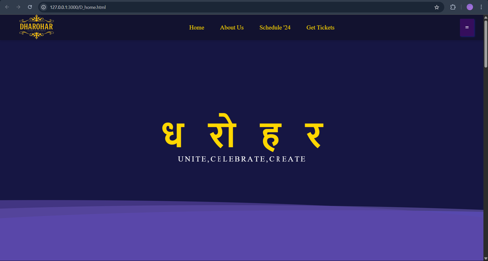
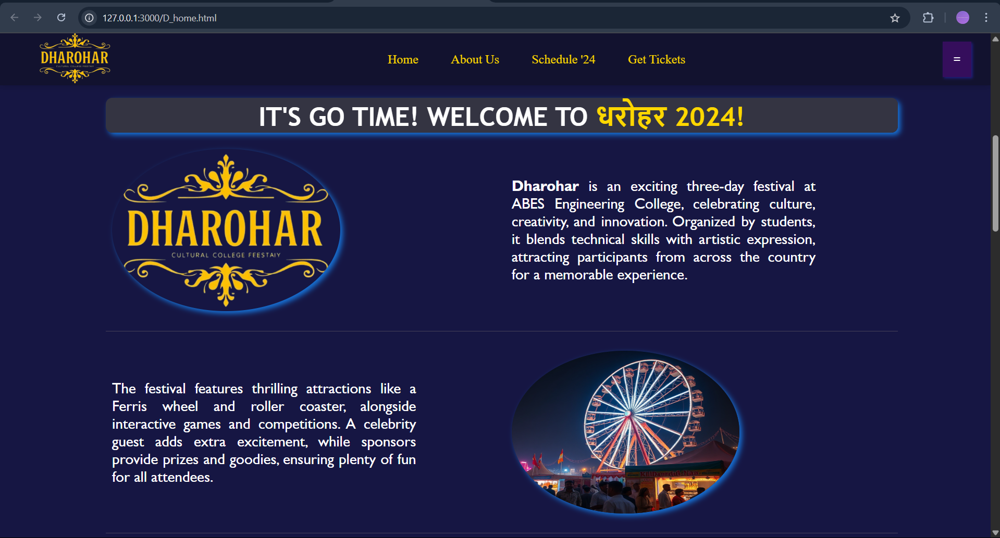
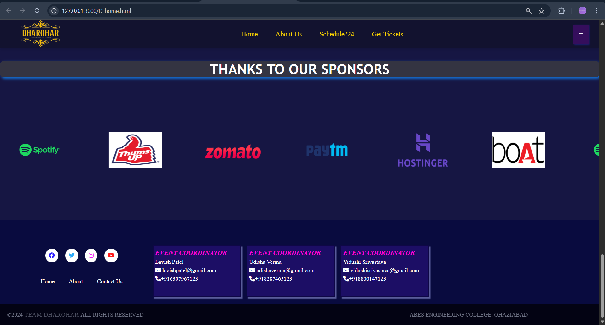
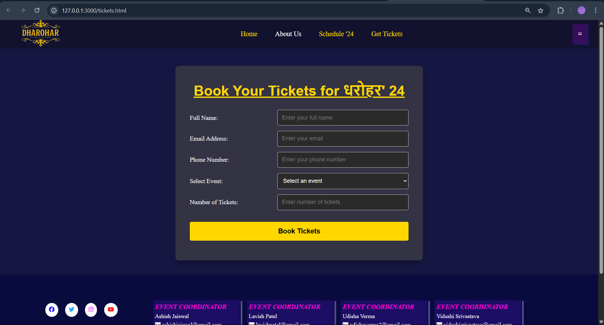
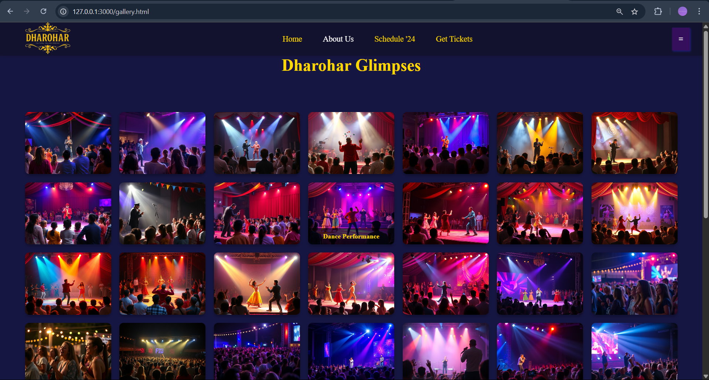

# FSD-Mini-Project

# Dharohar - ABES Engineering College Fest Website 🎉

**Dharohar** is the official website for the annual cultural fest of ABES Engineering College. It provides a vibrant, responsive, and interactive platform for attendees, organizers, and sponsors to connect, explore event details, purchase tickets, and view media from past events.

## 🌐 Project Overview

This website aims to:

- Showcase event highlights and schedules
- Facilitate online ticket booking
- Provide sponsor visibility
- Improve accessibility and engagement through responsive design and multimedia integration

## 📁 Project Structure

├── home_page_images/ # Images used on the home page
├── picture_gallery_images/ # Images for the gallery section
├── contact-us.html # Contact form and coordinator info
├── D_faq.html # Frequently asked questions
├── D_home.html # Main homepage
├── Dharohar_logo_cropped.png # Official logo
├── gallery.html # Event gallery
├── README.md # Project overview and instructions
├── refund_policy.html # Ticket refund and cancellation policy
├── schedule.html # Full event schedule
├── style.css # Website styling
├── tickets.html # Ticket booking page

## 🚀 How to Run the Project

1. Clone the repository:
   git clone https://github.com/your-username/dharohar-website.git
   cd dharohar-website

2. Open `D_home.html` in a web browser.

> 💡 No backend is required for this version. All interactions are handled on the front end using HTML and CSS.

## 📌 Features

- Responsive and accessible design \[1]\[2]
- Dynamic gallery and visual effects \[3]\[5]
- Ticket booking UI with refund policy
- Sponsor and event information sections
- Navigation and contact pages

## 🔧 Technologies Used

- HTML5 & CSS3
- Responsive design using media queries
- Accessibility standards (WCAG 2.1 compliant) [2][8]

## 📄 License

None. This project is just for educational purposes.

**References:**
[1] Marcotte, E. (2010). _Responsive Web Design_. A Book Apart.
[2] W3C. (2015). _Responsive Design Basics_. https://www.w3.org
[3] Garrett, J. J. (2011). _The Elements of User Experience_. New Riders.
[5] Duckett, J. (2014). _HTML and CSS: Design and Build Websites_. Wiley.
[8] W3C. (2018). _Web Content Accessibility Guidelines (WCAG) 2.1_. https://www.w3.org/WAI/

## Future Enhancements:

Backend integration for event registration and ticket tracking

User login and profile dashboards

Admin panel for dynamic schedule/content updates

Chatbot for live user queries

Mobile application with offline access and push notifications

Real-time analytics dashboard for organizers

Live-streaming for virtual participation

Improved accessibility support (voice nav, screen reader optimization)

## 👩‍💻 Contributors

| Name                    |                            Role & Contributions                                                  |
|-------------------------|--------------------------------------------------------------------------------------------------|
| **Udisha Verma**        | Frontend design ideation; Developed footer, refund policy page, and FAQ section                  |
| **Vidushi Srivastava**  | Implemented frontend; Designed and built the Home page, Ticket Booking page, and Picture Gallery | https://github.com/Vidushi-1012
| **Lavish Patel**        | Team Leader; Oversaw task management; Developed the Schedule and Contact Us pages                | https://github.com/Lavish0007

## Implementation

# Dharohar-A-College-Fest-Website
